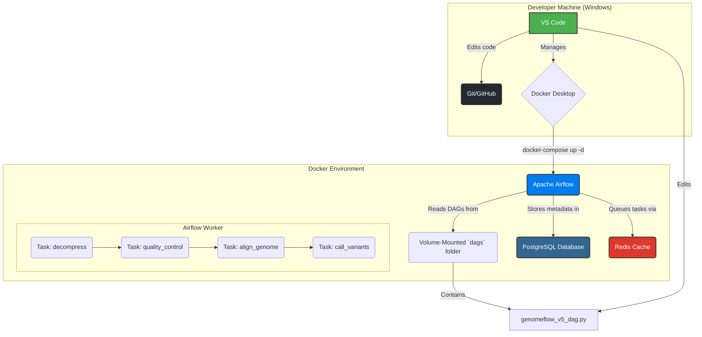

# Project GenomeFlow


---

### 1. Introduction: A Personal Motivation

This project is a deeply personal endeavor inspired by my own journey through the world of genomic medicine. I was diagnosed with a rare mitochondrial condition (a COA3 gene mutation) thanks to the UK's 100,000 Genomes Project. That process, which turned raw genetic data into a life-changing diagnosis, seemed like magic. This project is my attempt to demystify that magic.

**Project GenomeFlow** is a simulated but technically robust bioinformatics data pipeline. It uses professional-grade data engineering tools to mimic the exact workflow that scientists use to find genetic variants, like the one that affects my own health. It is designed to be a portfolio piece to showcase practical data orchestration and DevOps skills, and it will serve as the foundation for my Final Year Project.

### 2. Project Goal

The primary goal is to build an automated, containerized, and observable data pipeline using **Apache Airflow** and **Docker**. The pipeline takes a fictional raw DNA sequencing file and processes it through several key bioinformatics stages to ultimately identify and flag a "variant of interest" in a specific gene, simulating my own diagnostic journey.

### 3. System Architecture

The project runs as a self-contained, multi-container application on a local machine, orchestrated by Docker Compose. This architecture mirrors modern cloud-native applications, emphasizing reproducibility and separation of concerns.



### 4. Technology Stack

| Technology              | Role                                                                                                                                              |
| :---------------------- | :------------------------------------------------------------------------------------------------------------------------------------------------ |
| **Apache Airflow**      | The "brain" of the operation. Orchestrates the multi-step workflow, manages dependencies, handles retries, and provides a UI for observability. |
| **Docker & Docker Compose** | Creates a consistent and isolated "mini-cloud" on the local machine. Packages all services into reproducible containers.                      |
| **Python 3.11**         | The core programming language for writing the Airflow pipeline logic (DAGs).                                                                      |
| **PostgreSQL**          | The metadata database where Airflow stores the state of all its DAGs, task runs, and history.                                                   |
| **Redis**               | A high-speed message broker used by Airflow as a queue to distribute tasks to workers.                                                            |
| **Bioinformatics Tools**| `FastQC`, `BWA`, `Samtools`, and `BCFtools` are industry-standard command-line tools installed in the Docker environment to perform the analysis.   |
| **Git & GitHub**        | Version control system for tracking all code changes and hosting the public portfolio repository.                                                 |


### 5. The Final Pipeline: `genomeflow_pipeline_v5`

The project culminates in a 5-step pipeline that simulates a complete genomic analysis:

1.  **`decompress_sample`**
    *   **Tool:** `gunzip`
    *   **Action:** Decompresses the raw sequencing data (`.fastq.gz`) to prepare it for analysis.

2.  **`run_quality_control`**
    *   **Tool:** `FastQC`
    *   **Action:** Analyzes the raw reads and generates an HTML report on the quality of the sequencing data.

3.  **`align_genome`**
    *   **Tools:** `BWA-MEM` & `Samtools`
    *   **Action:** Aligns the sequencing reads to a reference genome and creates a standard, compressed Binary Alignment Map (`.bam`) file.

4.  **`call_and_flag_variants`**
    *   **Tools:** `bcftools` & `grep`
    *   **Action:** Analyzes the alignment file to identify genetic variants (differences from the reference) and creates a Variant Call Format (`.vcf`) file. It then uses `grep` to search this file for the specific gene of interest (`chr22`), succeeding only if it is found.

### 6. How to Run This Project

To run this entire pipeline on your own machine, follow these steps:

**Prerequisites:**
*   [Git](https://git-scm.com/downloads) installed.
*   [Docker Desktop](https://www.docker.com/products/docker-desktop/) installed and running.

**Instructions:**
1.  **Clone the repository:**
    ```bash
    git clone https://github.com/Harry5haw/project-genomeflow.git
    cd project-genomeflow
    ```

2.  **Launch the Airflow Environment:**
    This single command will build the custom Docker image with all tools and launch the entire Airflow application.
    ```bash
    docker-compose up -d --build
    ```

3.  **Access the Airflow UI:**
    *   Open your web browser and go to: `http://localhost:8080`
    *   Log in with the default credentials:
        *   **Username:** `airflow`
        *   **Password:** `airflow`

4.  **Trigger the Final Pipeline:**
    *   On the main DAGs screen, find `genomeflow_pipeline_v5`.
    *   Un-pause the DAG by clicking the toggle on the left.
    *   Trigger the pipeline by clicking the "play" button (▶️) on the right.

You can watch the pipeline execute in the Grid View. Once complete, all the generated output files (QC reports, alignments, and variant calls) will be visible in the `data/` subdirectories on your local machine.

### 7. Future Work

This 30-hour project serves as a robust foundation. For my Final Year Project, I plan to expand on this work by:
*   **Integrating with Cloud Services:** Using AWS S3 for data storage instead of the local filesystem.
*   **Scaling with Cloud Compute:** Running Airflow workers on a scalable platform like AWS ECS or EKS.
*   **Infrastructure as Code:** Defining and managing all the required cloud infrastructure using Terraform.
*   **Advanced Python Operators:** Replacing `BashOperator` tasks with custom `PythonOperator` tasks for more complex logic and error handling.
